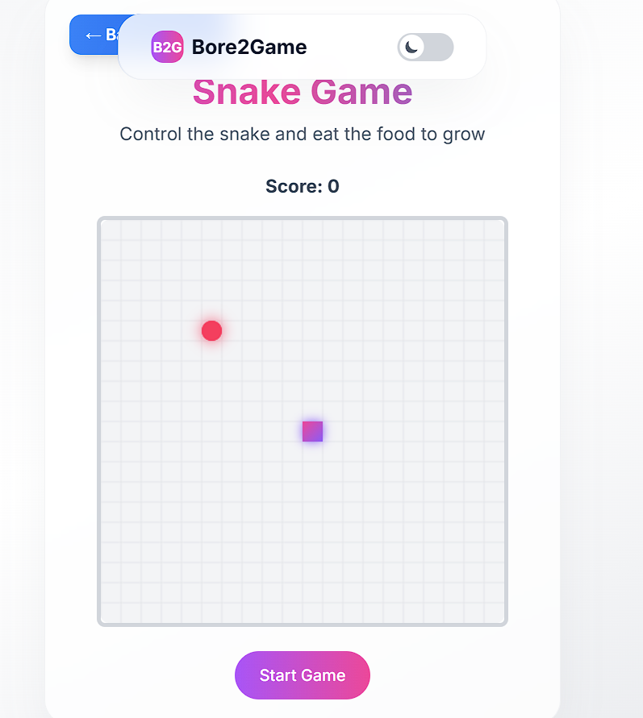

# 🎮 Bore2Game

[](https://reactjs.org/)
[](https://tailwindcss.com/)
[](LICENSE)

**Bore2Game** is a modern and engaging gaming platform built using **ReactJS** and **Tailwind CSS**. It hosts a collection of fun and interactive browser-based games. Whether you're bored or taking a break, Bore2Game is your one-stop solution for entertainment!

---

## 🚀 Live Demo

🌐 [Click here to play Bore2Game](https://your-live-site-link.com)  


---

## 📸 Screenshots





---

## ✨ Features

- 🕹️ Collection of fun and casual web games
- ⚡ Built with fast and responsive ReactJS components
- 🎨 Clean UI using Tailwind CSS
- 📱 Mobile-friendly and fully responsive design
- 🌐 Easy navigation with React Router
- 🔁 Instantly playable — no login required

---

## 🛠 Tech Stack

- **Frontend:** ReactJS
- **Styling:** Tailwind CSS
- **Routing:** React Router DOM
- **Hosting:**  Vercel  

---

## 📦 Installation & Setup

```bash
# Clone the repo
git clone https://github.com/your-username/Bore2Game.git

# Navigate into the project directory
cd Bore2Game

# Install dependencies
npm install

# Start the development server
npm start
